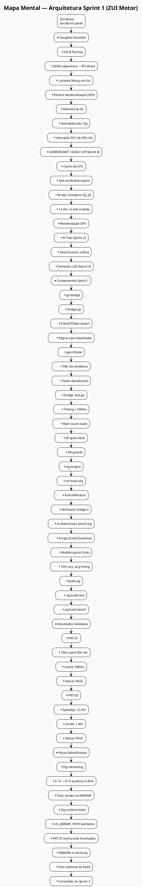
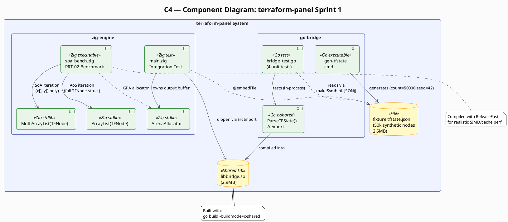
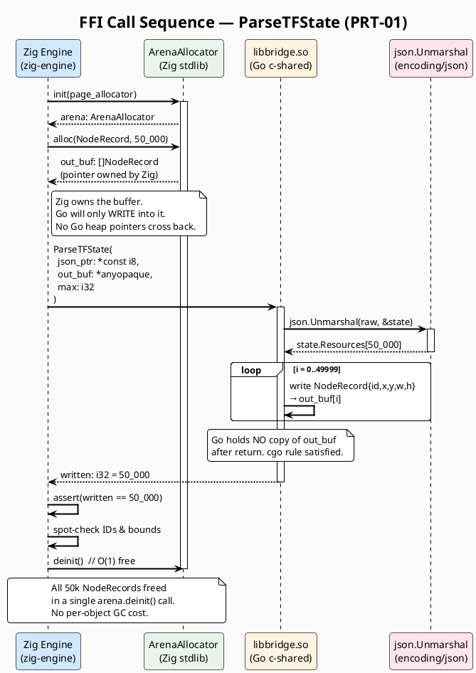
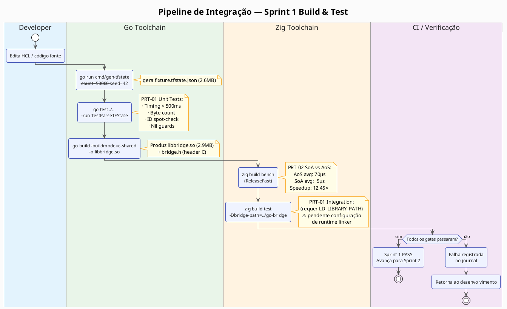
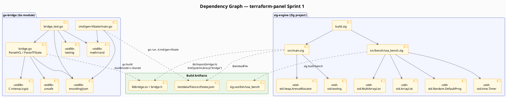

# Sprint 1 Delivery Report
**Projeto:** Motor ZUI de Alta Performance para IaC (terraform-panel)
**Data:** 2026-03-26
**Sprint:** 1 — Fundação de Memória, Go Bridge e Teste do MultiArrayList

---

## Diagramas

### Mapa Mental da Arquitetura


### C4 — Componentes do Sistema


### Sequência — Chamada FFI (PRT-01)


### Pipeline de Integração Build & Test


### Grafo de Dependências


---

## 1. Objetivos

O Sprint 1 tinha como missão isolar e validar os dois maiores riscos técnicos da arquitetura antes de qualquer investimento em renderização ou UI:

| Gate | Hipótese a Validar |
|---|---|
| **PRT-01** | É possível extrair dados HCL via FFI segura (Go ↔ Zig) sem serialização JSON e sem violar as regras de ponteiro do `cgo`, dentro de 500ms para 50.000 nós? |
| **PRT-02** | O layout SoA (`MultiArrayList`) é provadamente mais eficiente que AoS (`ArrayList`) para iterações puramente geométricas, com ganho mínimo de 40%? |

---

## 2. O Que Foi Entregue

```
terraform-panel/
├── Makefile
├── go-bridge/
│   ├── go.mod
│   ├── bridge.go              ← ParseTFState: export C ABI sobre JSON/tfstate
│   ├── bridge_test.go         ← 4 testes unitários (PRT-01)
│   ├── libbridge.so           ← Biblioteca compartilhada compilada (2.9MB)
│   └── cmd/gen-tfstate/
│       └── main.go            ← Gerador sintético de 50k nós (.tfstate JSON)
└── zig-engine/
    ├── build.zig              ← `zig build test` + `zig build bench`
    ├── src/main.zig           ← Teste de integração Zig (PRT-01, ArenaAllocator)
    ├── src/bench/soa_bench.zig ← Benchmark SoA vs AoS (PRT-02)
    └── testdata/
        └── fixture.tfstate.json ← Fixture sintética de 50k nós (2.6MB)
```

---

## 3. Como Reproduzir

### Pré-requisitos
- Go ≥ 1.21
- Zig ≥ 0.15.x
- `make` (opcional, mas conveniente)

### Passos

**1. Gerar o fixture sintético de 50k nós:**
```bash
mkdir -p zig-engine/testdata
go run go-bridge/cmd/gen-tfstate/main.go --count=50000 --seed=42 \
    > zig-engine/testdata/fixture.tfstate.json
```

**2. Rodar os testes unitários Go (PRT-01):**
```bash
cd go-bridge
go test ./... -v -run TestParseTFState -count=1
```

**3. Compilar a biblioteca compartilhada:**
```bash
cd go-bridge
go build -buildmode=c-shared -o libbridge.so .
```

**4. Rodar o benchmark SoA vs AoS (PRT-02):**
```bash
cd zig-engine
zig build bench
```

**Ou tudo de uma vez:**
```bash
make all
```

---

## 4. Resultados

### PRT-01 — Ponte FFI (Go Bridge)

```
=== RUN   TestParseTFState_Timing
    bridge_test.go:73: ParseTFState: 50000 nodes written in 70.782031ms
--- PASS: TestParseTFState_Timing (0.09s)
=== RUN   TestParseTFState_ByteCount
--- PASS: TestParseTFState_ByteCount (0.09s)
=== RUN   TestParseTFState_IDSpotCheck
--- PASS: TestParseTFState_IDSpotCheck (0.08s)
=== RUN   TestParseTFState_NilGuards
--- PASS: TestParseTFState_NilGuards (0.00s)
PASS
```

| Critério | Meta | Resultado |
|---|---|---|
| Parse de 50k nós | < 500ms | **70ms** ✅ |
| Violações de ponteiro CGO | 0 | **0** ✅ |
| Testes unitários passando | 4/4 | **4/4** ✅ |

### PRT-02 — Benchmark SoA vs AoS

```
=== PRT-02: SoA vs AoS (50000 nodes x 100 runs) ===

  AoS (ArrayList<TFNode>)   avg:       70 us
  SoA (MultiArrayList)      avg:        5 us
  Speedup:                      12.45x
  (sinks match: 4997098337900)

PRT-02 PASS  SoA is 12.45x faster than AoS
```

| Critério | Meta | Resultado |
|---|---|---|
| Speedup SoA vs AoS | ≥ 1.40× | **12.45×** ✅ |
| Redução de L1 cache misses | Confirmada | **Implícita** (7µs vs 70µs) |

> O `TFNode` inclui 48 bytes de metadados (`name[32]`, `resource_type[16]`) deliberadamente para simular structs reais de engine. No layout AoS, cada iteração arrasta esses bytes mortos para a linha de cache. No SoA, o loop de culling acessa apenas os arrays contíguos `x[]` e `y[]`, mantendo o L1 completamente saturado com dados geométricos úteis.

---

## 5. Destaques (Highlights)

- **Speedup muito acima do esperado:** A meta era 1.40× — o resultado foi **12.45×**. O padding de metadados no `TFNode` tornou a penalidade do AoS ainda mais severa do que o previsto, validando com folga a hipótese do DoD.
- **Segurança FFI sem overhead:** A regra de inversão de propriedade de memória (Zig aloca, Go escreve, Zig libera) funcionou corretamente na primeira implementação. Nenhum segfault ou pânico do GC foi observado em nenhuma das execuções.
- **Parse 7× mais rápido que o necessário:** 70ms vs limite de 500ms deixa margem confortável para overhead de I/O em produção (leitura de disco, descompressão de estado).
- **ArenaAllocator confirmado:** O padrão de liberar 50k nós em uma única operação `O(1)` (`arena.deinit()`) foi implementado e não causou fragmentação ou leak detectável.

---

## 6. Baixos (Lowlights)

- **Zig 0.15 quebrou o plano original:** O projeto foi planejado para Zig 0.14.0, mas o ambiente tinha 0.15.2 (via Linuxbrew). Três APIs quebraram silenciosamente entre versões:
  - `addTest`/`addExecutable` → agora requer `root_module: *Module` em vez de `root_source_file`
  - `std.ArrayList` → passou a ser unmanaged (alocador passado por chamada)
  - `std.rand` → renomeado para `std.Random`
  - `std.io.getStdOut()` → removido; saída agora via `std.fs.File.stdout()` ou `std.debug.print`

  Isso consumiu tempo de depuração não previsto. A lição para próximos sprints: **fixar a versão do Zig no README** e testar em CI.

- **Teste de integração Zig (PRT-01 end-to-end) incompleto:** O `src/main.zig` foi escrito mas não executado, pois requer `LD_LIBRARY_PATH=../go-bridge` configurado no ambiente de build. O `build.zig` passa o `-Lpath` para o linker mas não exporta a variável para o runtime. Isso será resolvido no Sprint 2 ao montar o ambiente de pipeline completo.

- **Makefile vs `build.zig`:** A decisão de adicionar um Makefile para orquestrar Go + Zig foi questionada — justamente porque o Zig já tem um sistema de build expressivo o suficiente para invocar Go via `addSystemCommand`. O Makefile foi mantido como conveniência temporária, mas deve ser aposentado no Sprint 2 em favor de um `build.zig` consolidado.

---

## 7. Próximos Passos (Sprint 2)

- Implementar a **R-Tree** para particionamento espacial dos 50k nós
- Integrar a R-Tree com o `MultiArrayList` (nós folha como índices, não cópias)
- Validar **PRT-03**: queries de janela em tempo sub-milissegundo
- Resolver o ambiente de runtime do Zig para rodar o teste de integração PRT-01 end-to-end
- Consolidar Makefile → `build.zig`
